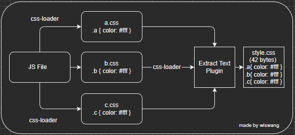

# Webpack

## Ⅰ. 认识 webpack 工具

### 1. 内置模块 path

- path 模块提供很多好用的方法用于对路径和文件进行处理
- window 使用 \ 或者 \\\ 作为文件路径分隔符
- mac os 和  Linux 的 Unix 操作系统上使用 / 作为文件路径的分隔符

- 在 window 编写的程序,部署到 Linux 就会报错
  - 路径出现一些问题
  - path 模块的出现, 可以解决出现的差异问题

### 2. path 常见的 API

- 从路径中获取信息

  - dirname: 获取文件的父文件夹
  - basename: 获取文件名
  - extname: 获取文件拓展名

- **路径的拼接: path.join**

  - 多个路径拼接, 可以在不同操作系统中通用

- **拼接绝对路径: path.resove**

  - path.resolve() 方法会把一个路径或路径片段的序列解析为一个绝对路径
  - 给定的路径的序列是从右往左被处理的, 后面每个 path 被一次解析, 直到构造完成一个绝对路径
  - 如果在处理完所有给定 path 的段之后, 还没有生成绝对路径, 则使用当前工作目录
  - 生成的了路径被规范化并删除尾部斜杠, 零长度 path 段被忽略
  - 如果没有 path 传递段, path.resolve() 将返回当前工作的绝对路径

- 软链接和硬链接

  - 软链接 (符号链接 Symbolic link)
    - 其包含有一条以绝对路径或者相对路径的形式指向其他文件或者目录的引用
  - 硬链接 (Hard link)
    - 电脑文件系统中的多个文件平等地共享同一个文件存储单元

  ```shell
  # 文件拷贝
  # windows
  copy test.js test-copy.js
  # macos
  cp test.js test-copy.js
  
  # 文件硬链接
  # windows
  mklink /H test_hard.js test.js
  # macos
  ln test.js test_hard.js
  
  # 文件软链接
  # windows 
  mklink test_soft.js test.js
  # macos
  ln -s test.js test.soft.js
  
  ```


### 3. webpack

- webpack 是一个**现代 JavaScript 应用程序的静态模块打包器**(module bundler)
  - webpack is a **static** **module** **bundler** for modern JavaScript applications
    - bundler (打包): webpack 是一个打包工具
    - static (静态): webpack 将代码打包成静态资源
    - module (模块化): webapck 支持各种模块化开发, 如 ES Module、CommonJS、AMD 等
- Vue-CLI、create-react-app、Angular-CLI 都是基于 webpack 来帮助我们支持模块化、less、TypeScript、打包优化等 

### 4. Webpack 使用前提

- [webpack 官方文档: https://webpack.js.org](https://webpack.js.org)
  - [webpack 中文文档: https://webpack.docschina.org/](https://webpack.docschina.org/)
- webpack 运行的依赖 Node 环境
- 安装Node.js 和 npm, [Node.js 安装教程]()

### 5. Webpack 的安装

- webpack 安装分为两个: webpack 和 webpack-cli

  - 运行 webpack 命令, 会运行 node_modules 下的 .bin 目录下的 webpack
  - webpack 在运行时是依赖 webpack-cli的, 如果没安装会报错
  - webpack-cli 中代码执行时, 才是真正利用 webpack 进行编译和打包的过程
  - 所以在安装 webpack 时, 需要同时安装 webpack-cli

- 安装命令

  ```shell
  # 全局安装
  npm install webpack webpack-cli -g
  
  # 局部安装 (推荐这样安装)
  npm install webpack webpack-cli -D
  ```

- 创建局部的 webpack

  ```shell
  # 一: 创建 package.json 文件, 用于管理项目的信息、依赖库等
  npm init
  
  # 二: 安装局部 webpack
  npm install webpack webpack-cli -D
  
  # 三: 使用局部 webpack
  npx webpack
  
  # 四: 在 package.json 中创建 scripts 脚本, 执行脚本打包命令
  
  "scripts": {
  	"build"	: "webpack"
  }
  ```


### 6. Webpack 的打包

- 在目录下执行 webpack 命令进行项目打包

- 打包后生成 dist 文件夹,里面有 main.js 文件

  - 默认情况下 webpack 不知道文件是否转成 ES5 之前语法,需要配置 bable 进行转换和设置

- 当运行 webpack 时, webpack 会把 src/index.js 作为入口文件

  ```shell
  # 或者手动配置指定入口和出口文件
  npx webpack --entry ./src/main.js --output-path ./build
  ```

### 7. webpack配置文件

- 项目根目录创建 webpack.config.js 文件, 作为 webpack 的配置文件

  ```shell
  const path = require('path')
  
  # 导出配置信息
  module.exports = {
  	entry: "./src/main.js",
  	output: {
  		filename: "bundle.js",
  		path: path.resolve(__dirname, "./dist")
  	}
  }
  ```

- 在 package.json 中指定配置文件

  ```shell
  # package.json
  {
  	"scripts": {
  		"build": "webpack --config testwebpack.config.js"
  	},
  	"devDependencies": {
  		"webpack": '^4.15.0',
  		"webpack-cli": '^3.2.1'
  	}
  }
  
  # 命令行中执行下面命令打包项目
  npm run build
  ```

## Ⅲ. Webpack loader

> loader 用于特定的模块类型进行转换

### 1. 编写和打包 CSS 文件

#### (1) CSS-Loader 的使用方案

- 内联方式

  - 不方便管理, 使用较少,

    ```shell
    import "css-loader!../css/style.css"
    ```

- CLI 方式 (webpack5 不再使用)

  - 不方便管理,使用较少

- 配置方式

### 2. 编写和打包 LESS 文件


### 3. postcss 工具处理 CSS


### 4. Webpack 打包图片


### 5. Webpack  打包 JS 代码


### 6. Babel 和 babel-loader


### 7. Webpack 打包 Vue


### 8. resolve 模块解析


## Ⅳ. Webpack 插件

### 1. 认识插件 Plugin

> Loader 用于特定的模块类型及进行转换
>
> Plugin 用于执行更加广泛的任务, 如 打包优化、资源管理、环境变量注入等 ,贯穿整个生命周期



### 2. CleanWebpackPlugin

重新打包删除之前打包的文件夹

### 3. HtmlWebpackPlugin


### 4. DefinePlugin


### 5. mode 模式配置

- 告知 webpack 使用的相应模式的内置优化
  - 默认值 produciton
  - 可选值: 'none' | 'development' | 'production'


## Ⅴ. webpack-dev-server

