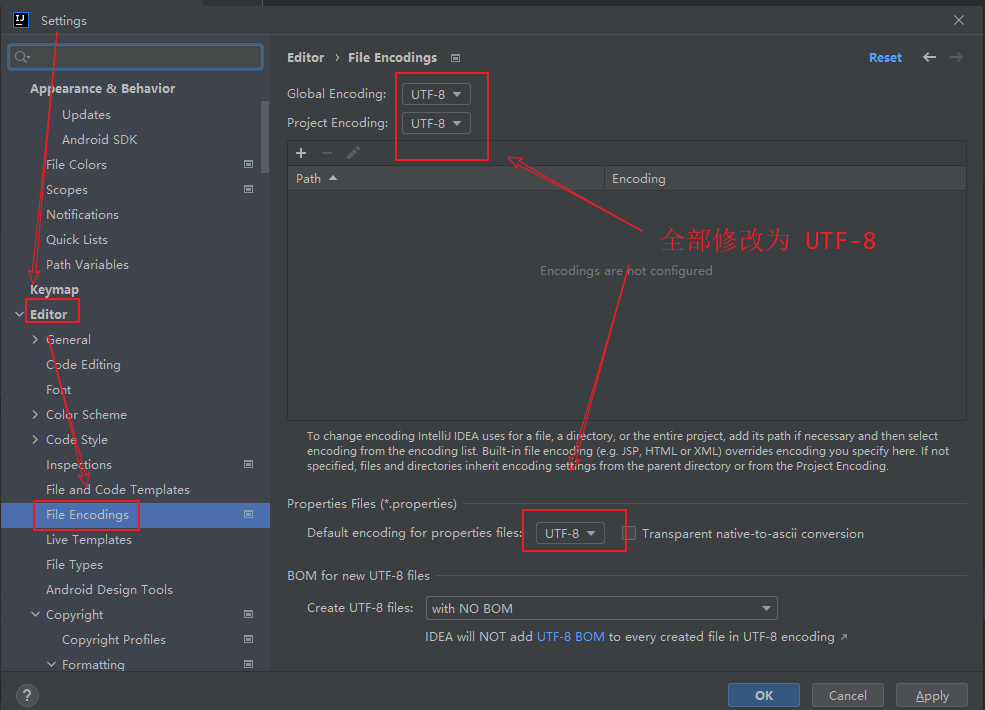

# Spring Boot + Vue3 前后端分离实战 wiki 知识库系统

## 1. SpringBoot 优势

- 创建项目只需要 1分钟
- 快速集成 Spring 生态组件
- 配置精简 开发快速
- 微服务集成 大中小型公司首选

## 2. SpringBoot 项目搭建

- 怎么创建
- 怎么运行
- 代码结构
- 创建第一个接口
- 日志
- 配置文件
- 热部署
- Git
- Maven

### 2-2. 搭建 SpringBoot 项目

- 两种方法创建 SpringBoot 项目

  - 方法一: [springboot官网创建](https://start.spring.io), 解压压缩包,用 IDEA 打开项目就可以了

    

  - 方法二: 用 IDEA 创建

    ​		

## 2.3 项目配置

- 编码配置

  IDEA → file → setting

  

  

