#  MySQL8.0安装与配置

## 方法一: zip 压缩安装

### 1. 官网下载安装包

[打开MySQL官网下载安装包](http://wiki.xuetang9.com/?p=5386)

不需登录, 点击下载, 如下图所示:

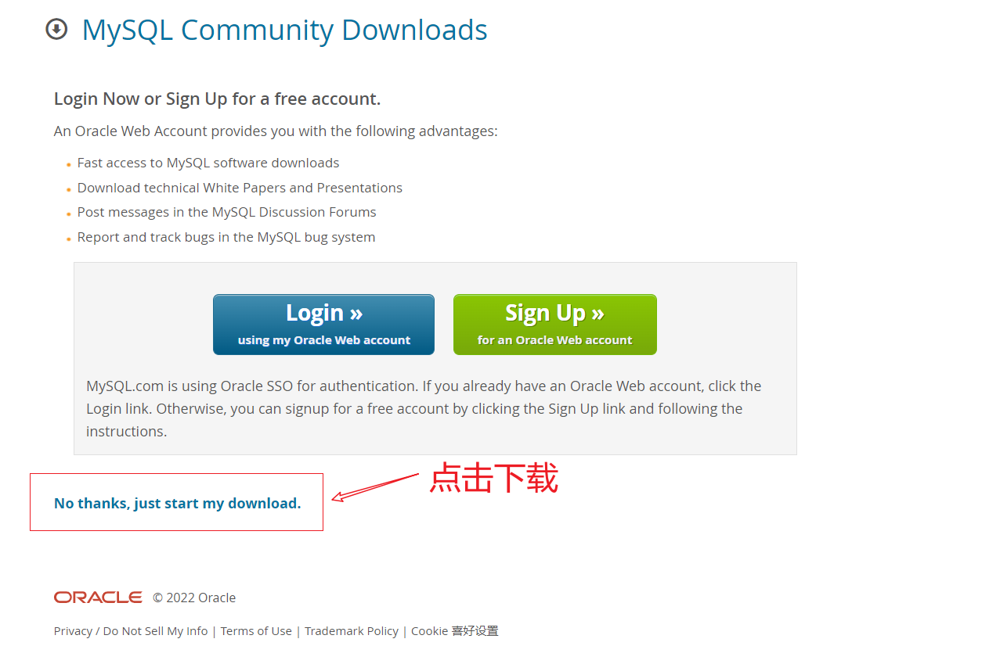

### 2. 解压安装包

解压安装包到自己软件安装盘, 如我解压到 D:\software 文件中

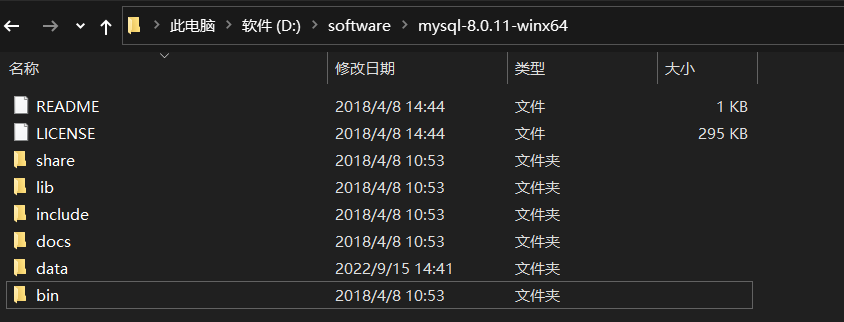

### 3. 配置环境变量

>  将 mysql 中的 bin目录加到环境变量中

- 打开环境变量快捷键: win + r 后输入 sysdm.cpl, 点击回车, (或者右键单击此电脑 → 属性 → 高级系统设置 →环境变量  )

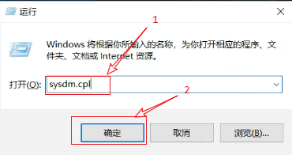

- 打开环境变量

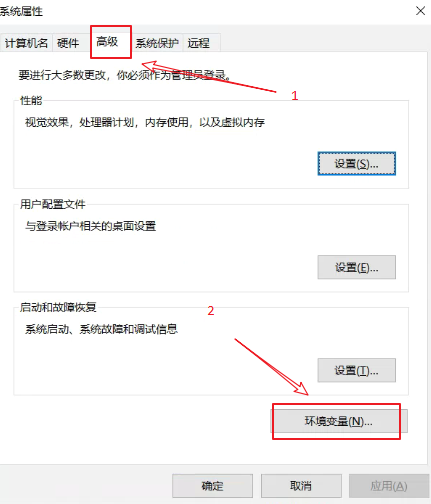

- 新建系统变量 配置变量名为 MySQL, 变量值为 mysql 安装路径 D:\software\mysql-8.0.11-winx64\

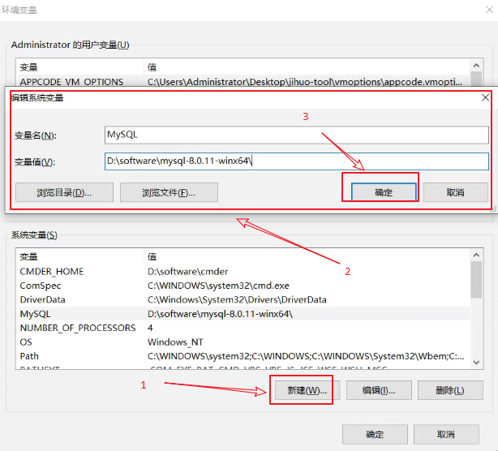

- 将配置的系统变量 添加到 Path 中, 具体步骤如下图所示

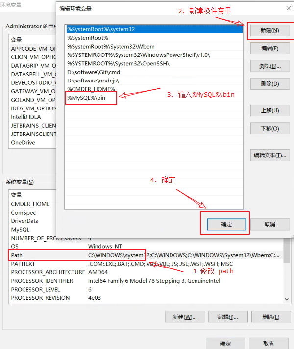

### 4. 新建  data 文件夹 和 my.ini 文件 

data文件夹: 存放数据文件

打开 my.ini 文件并写入如下配置

```shell
[mysqld]
# 设置服务端口为3306
port=3306
# 设置mysql的安装目录，注意目录需要使用\\连接
basedir=D:\\Soft\\mysql-8.0.11-winx64
# 设置mysql数据库的数据的存放目录，注意目录需要使用\\连接
datadir=D:\\Soft\\mysql-8.0.11-winx64\\data
# 允许最大连接数
max_connections=200
# 允许连接失败的次数。这是为了防止有人从该主机试图攻击数据库系统
max_connect_errors=10
# 服务端使用的字符集默认为UTF8
character-set-server=utf8
# 创建新表时将使用的默认存储引擎
default-storage-engine=INNODB
# 默认使用“mysql_native_password”插件认证
default_authentication_plugin=mysql_native_password
[mysql]
# 设置mysql客户端默认字符集
default-character-set=utf8
[client]
# 设置mysql客户端连接服务端时默认使用的端口
port=3306
default-character-set=utf8

```

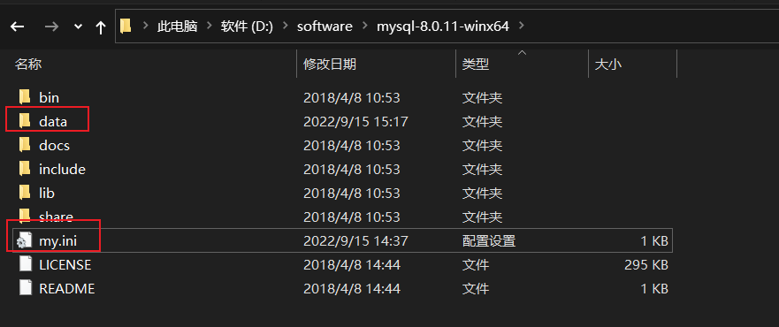


### 5. 初始化数据库

win + x 快捷键 选择  Windows PowerShell(管理员)(A) 菜单

然后进入到 mysql 安装包的 bin 目录下

```shell
D:
cd D:\software\mysql-8.0.11-winx64
cd bin
mysqld --initialize --console

# root 初始用户名
# T1xD9?B/AuWF 初始密码 
```

**注: 牢记初始密码, 后面需要用到**, 如果忘记, 删除掉 data 目录文件, 重新执行命令 mysqld --initialize --console ,重新生成

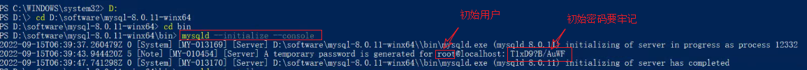

### 6. 安装服务

```shell
# 默认为 mysql, 可省略
mysqld --install [服务名]
```

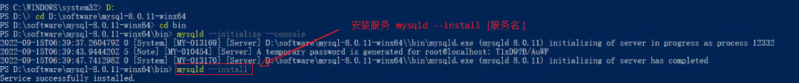


### 7. 启动服务

通过命令启动停止服务 (或者在服务面板中操作)

```shell
# 启动服务
net start mysql

# 停止服务
net stop mysql
```

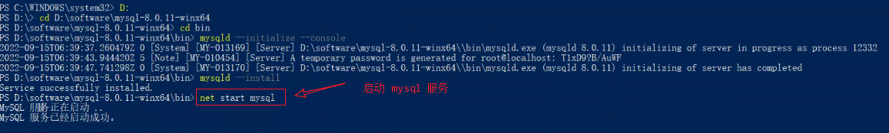


### 8. 修改初始密码

系统生成密码复杂不易记忆, 修改初始密码

```shell
# 进入数据库 
mysql -u root -p 

# 修改密码为 123456
ALTER USER 'root'@'localhost' IDENTIFIED WITH mysql_native_password BY '123456'; 
```

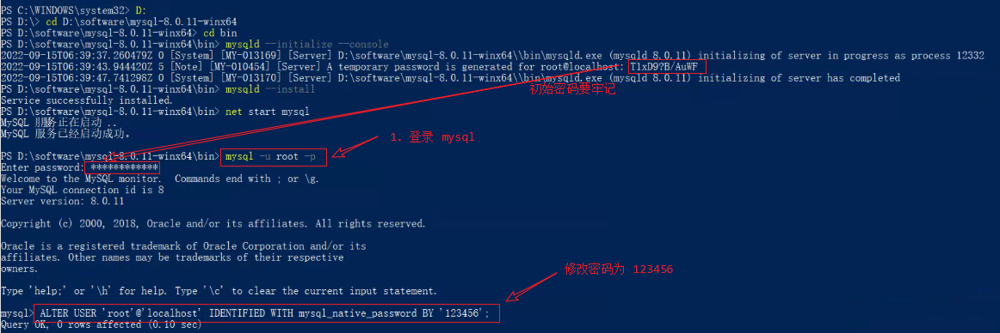

**安装完毕**


## 方法二: msi 文件安装